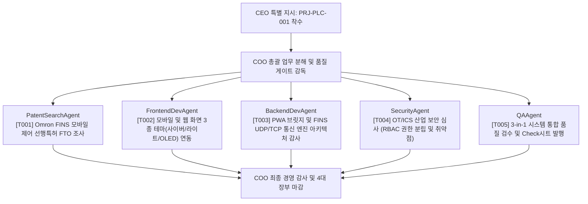

# [PROJECT CHARTER] 가상회사 제1호 공식 프로젝트: PLC 모니터링 & 원격 제어 통합 플랫폼 (PRJ-PLC-001)

- **프로젝트 ID**: `PRJ-PLC-001`
- **프로젝트 명**: PLC 모니터링 & 제어 시스템 (3-in-1 Total Suite) 고도화 및 전사 품질 표준화
- **발의 일자**: 2026-09-18
- **형상 브랜치**: `feature/plc-monitoring-v1`
- **물리 소스코드 경로**: `projects/plc-monitoring-v1/`
- **최고 책임자**: CEO KANG SEUNG HEON
- **총괄 운영 책임**: COOAgent (AI Virtual Company OS)

---

## 1. 프로젝트 개요 및 비즈니스 목표
본 프로젝트는 Omron CJ2H-EIP 및 NX/NJ 시리즈 PLC를 대상으로 산업 현장의 안전과 운영 효율성을 극대화하기 위한 **3-in-1 통합 모니터링 및 원격 제어 플랫폼**의 소스코드를 인수하고, 전사적인 품질 표준화, 선행특허 FTO 리스크 해소, 모바일/웹 3종 테마 연동, 그리고 OT/ICS 보안 심사를 통과시키는 가상회사의 공식 제1호 전략 프로젝트입니다.

---

## 2. 3대 핵심 아키텍처 구성

| 시스템 구분 | 기술 스택 | 물리 경로 | 주요 역할 |
| :--- | :--- | :--- | :--- |
| **옵션 1: PC 웹 & GMS 관제** | Node.js (포트 3000), Vanilla JS/Grid | `projects/plc-monitoring-v1/pc-app/` | 관제실 PC 대화면 관제, GMS 7단계 가스 퍼지 시퀀스, 16개 서브시퀀스 제어 |
| **옵션 2: 현장 직결 모바일 앱** | Flutter (Dart), UDP FINS 통신 | `projects/plc-monitoring-v1/mobile-app/` | 작업자 스마트폰 직결 P2P 제어, Z폴드5 듀얼 화면 반응형, 오프라인 무결성 |
| **옵션 3: 모바일 PWA 브릿지** | Node.js HTTPS (포트 3001), PWA | `projects/plc-monitoring-v1/pwa-bridge/` | 무설치 모바일 브라우저 제어, 3단계 RBAC 권한 분립, 감사로그(Audit Log) |

---

## 3. 부서별 1단계 전사 수행 과제 (Work Breakdown Structure)

1. **선행특허팀 (`PatentSearchAgent`)**:
   - `Omron CJ2H FINS 프로토콜 모바일 P2P 직접 제어` 관련 KR/US/EP 선행특허 전수 조사.
   - 특허 침해(FTO) 리스크 평가 및 독자 기술 청구항 도출.
2. **프론트엔드팀 (`FrontendDevAgent`)**:
   - `pc-app` 및 `pwa-bridge` 화면에 가상회사의 3종 테마(사이버 다크, 모던 라이트, OLED 제트블랙) 스타일링 적용.
   - 360~430px 및 Z폴드5 폴더블 뷰포트 가독성 최적화.
3. **백엔드팀 (`BackendDevAgent`)**:
   - `pwa-bridge/src/plcClient/udpFinsClient.js` 및 `tcpFinsClient.js` 코드 검토.
   - 비동기 소켓 연결 안정성 및 오류 복구(Failover) 매커니즘 보강.
4. **보안팀 (`SecurityAgent`)**:
   - 산업용 제어시스템(OT/ICS) 특화 보안 점검: 허가되지 않은 PLC 메모리 쓰기 방지(Command Guard) 심사.
   - 3단계 RBAC 권한 검증 및 감사로그 변조 방지 점검.
5. **품질팀 (`QAAgent`)**:
   - 3-in-1 시스템 전 공정 품질 감사 체크시트 작성 및 최종 승인 보고서 발간.

---

## 4. 형상 관리 및 마일스톤
- **Git 브랜치**: `feature/plc-monitoring-v1`
- **1차 마일스톤 (M1)**: 소스코드 이관 및 PWA 브릿지 보안 Command Guard 코드 검토 및 하드닝
- **2차 마일스톤 (M2)**: 웹 관제실 3종 테마 적용 및 모바일 반응형 검증
- **3차 마일스톤 (M3)**: FINS UDP 통신 실측 시뮬레이션 및 최종 릴리스
