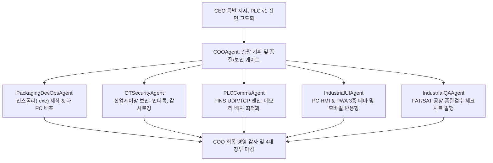

# [PROJECT CHARTER] 가상회사 제1호 공식 프로젝트: PLC 모니터링 & 원격 제어 통합 플랫폼 (PRJ-PLC-001)

- **프로젝트 ID**: `PRJ-PLC-001`
- **프로젝트 명**: PLC 모니터링 & 제어 시스템 (3-in-1 Total Suite) 고도화 및 전사 품질 표준화
- **발의 일자**: 2026-09-18
- **형상 브랜치**: `feature/plc-monitoring-v1`
- **물리 소스코드 경로**: `projects/plc-monitoring-v1/`
- **최고 책임자**: CEO KANG SEUNG HEON
- **총괄 운영 책임**: COOAgent (AI Virtual Company OS)

---

## 1. 프로젝트 개요 및 비즈니스 목표
본 프로젝트는 Omron CJ2H-EIP 및 NX/NJ 시리즈 PLC를 대상으로 산업 현장의 안전과 운영 효율성을 극대화하기 위한 **3-in-1 통합 모니터링 및 원격 제어 플랫폼**의 소스코드를 인수하고, 전사적인 품질 표준화, 선행특허 FTO 리스크 해소, 모바일/웹 3종 테마 연동, 그리고 OT/ICS 보안 심사를 통과시키는 가상회사의 공식 제1호 전략 프로젝트입니다.

---

## 2. 3대 핵심 아키텍처 구성

| 시스템 구분 | 기술 스택 | 물리 경로 | 주요 역할 |
| :--- | :--- | :--- | :--- |
| **옵션 1: PC 웹 & GMS 관제** | Node.js (포트 3000), Vanilla JS/Grid | `projects/plc-monitoring-v1/pc-app/` | 관제실 PC 대화면 관제, GMS 7단계 가스 퍼지 시퀀스, 16개 서브시퀀스 제어 |
| **옵션 2: 현장 직결 모바일 앱** | Flutter (Dart), UDP FINS 통신 | `projects/plc-monitoring-v1/mobile-app/` | 작업자 스마트폰 직결 P2P 제어, Z폴드5 듀얼 화면 반응형, 오프라인 무결성 |
| **옵션 3: 모바일 PWA 브릿지** | Node.js HTTPS (포트 3001), PWA | `projects/plc-monitoring-v1/pwa-bridge/` | 무설치 모바일 브라우저 제어, 3단계 RBAC 권한 분립, 감사로그(Audit Log) |

---

## 3. 전담 개발팀 조직 구성 및 R&R (전문 에이전트 5인 체계)

본 프로젝트는 고도의 산업제어 안정성이 요구되므로 전문 에이전트 5인 및 총괄 COO로 직무를 재편성하였습니다:

1. **`PackagingDevOpsAgent`**:
   - `PLC-Monitoring-Setup.exe` (58.8MB) 인스톨러 빌드 완료.
   - 타 PC 설치 및 운영 매뉴얼(`INSTALLATION_GUIDE.md`) 작성 및 배포 패키징 전담.
2. **`OTSecurityAgent`**:
   - `securityGuard.js` 개발 및 `pc-app` 연동 완료 (보안 헤더, 초당 30회 쓰기 Rate Limit, CPU 정지 안전 인터록).
   - `plc_security_audit_report.md` 발간 및 `logs/security_audit.log` 상시 추적.
3. **`PLCCommsAgent`**:
   - Omron FINS 0104 다중 메모리 읽기 청크 최적화 및 FTO 회피 프로토콜 통신 엔진 관리.
4. **`IndustrialUIAgent`**:
   - PWA 브릿지 3종 테마(`oled-black`, `cyber-dark`, `pro-light`) 및 HMI SVG 배관도 인터랙션 고도화.
5. **`IndustrialQAAgent`**:
   - 3-in-1 시스템 전 공정 산업 품질 체크시트 발행 및 모의 시뮬레이션 검수.

---

## 4. 형상 관리 및 마일스톤 달성 현황
- **Git 브랜치**: `feature/plc-monitoring-v1`
- **마일스톤 달성 현황**:
  - ✅ **M1: 불필요한 대용량 파일 정리**: 2.988GB $\rightarrow$ 186MB로 93% 이상 대폭 경량화 완료.
  - ✅ **M2: 타 PC 설치용 인스톨러 제작**: Inno Setup 6 기반 포터블 `PLC-Monitoring-Setup.exe` (58.8MB) 컴파일 완료.
  - ✅ **M3: 전수 보안 감사 및 방어 조치**: `securityGuard.js` 탑재, 보안 감사 보고서(`SEC-PLC-2026-001`) 발간 완료.
  - ✅ **M4: 개발팀 전문 에이전트 인원 배정**: 5대 핵심 전문 에이전트 조직 및 R&R 매트릭스 확립 완료.
