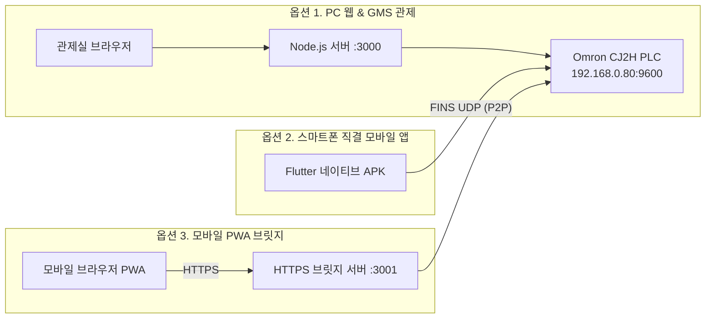

# PLC 모니터링 & 제어 시스템 (3-in-1 Total Suite)

> **공식 마스터 문서 안내**:
> - 📜 **전체 통합 질의응답 및 이력 (Part 1/2/3)**: [`docs/QNA.md`](docs/QNA.md)
> - 🏗️ **통합 아키텍처 및 품질 관리**: [`docs/PROJECT_MASTER_PDCA.md`](docs/PROJECT_MASTER_PDCA.md)
> - 💡 **개발 헌장 및 멘토링 가이드**: [`docs/00-start/SKILL_TREE.md`](docs/00-start/SKILL_TREE.md)

Omron CJ2H-EIP 및 NX/NJ 시리즈 PLC를 위한 **3-in-1 통합 모니터링 & 원격 제어 플랫폼**입니다. 관제실 PC 대화면 관제, 현장 작업자 스마트폰 직결 P2P 제어, 그리고 무설치 모바일 PWA 브라우저 제어를 모두 지원합니다.

---

## 🏗️ 3대 시스템 구성 (3-in-1 Options)



---

## 📂 통합 문서 분류 체계 (`docs/`)

```text
docs/
├── QNA.md                   ⭐ 전체 통합 질의응답 마스터 (Part 1/2/3)
├── PROJECT_MASTER_PDCA.md   🏗️ 3-in-1 통합 아키텍처 및 진척 매트릭스
├── 00-start/                💡 공통 개발 헌장 및 20년 멘토링 규칙 (SKILL_TREE.md)
├── pc/                      🖥️ [옵션 1] PC 웹 & GMS 가스제어 전용 문서
│   ├── GMS_AUTO_SEQUENCE_HANDOFF.md (GSP 7단계 시퀀스 상세)
│   ├── GMS_SUBSEQUENCE_EXCEL_GUIDE.md (16개 엑셀 가이드)
│   └── ISSUE_LOG_AND_DESIGN_STANDARDS.md (디자인 표준)
├── mobile/                  📱 [옵션 2] 스마트폰 직결 Flutter 앱 전용 문서
│   ├── 01-plan/ (PLAN.md, ENVIRONMENT.md)
│   ├── 02-design/ (DESIGN.md - Z폴드5 듀얼 반응형)
│   └── 05-act/ (REPORT.md - APK 릴리스 보고서)
└── pwa-bridge/              🌐 [옵션 3] 모바일 PWA 브릿지 전용 문서
    ├── 01-plan/ (schema.md, mobile-screen-plan.md)
    └── 02-design/ (design.md - 3단계 RBAC, 감사로그)
```

---

## 🚀 빠른 시작 가이드

### 1. [옵션 1] PC 웹 & GMS 시스템 실행
```powershell
cd "D:\02. AI 작업\01.Antigravity 공유 File\02. plc-monitoring ver1.0 - google\pc-app"
node src/server.js
```
* 브라우저 접속: **[http://localhost:3000/gms.html](http://localhost:3000/gms.html)**

### 2. [옵션 2] 스마트폰 직결 모바일 앱 실행
* 프로젝트 루트의 [`Omron_CJ2H_Direct_Monitor.apk`](Omron_CJ2H_Direct_Monitor.apk)를 안드로이드 폰에 설치하여 실행.
* 로그인: `admin` / `admin` (스마트폰 ↔ PLC 0.01초 직결 통신)

### 3. [옵션 3] 모바일 PWA 브릿지 서버 실행
```powershell
cd "D:\02. AI 작업\01.Antigravity 공유 File\02. plc-monitoring ver1.0 - google\pwa-bridge"
node src/server.js
```
* 모바일 브라우저 접속: **`https://10.219.30.135:3001`** (모바일 핫스팟 접속)
* 로그인: `admin` / `admin` ➔ 메뉴에서 [홈 화면에 추가] 선택 시 앱처럼 실행.
