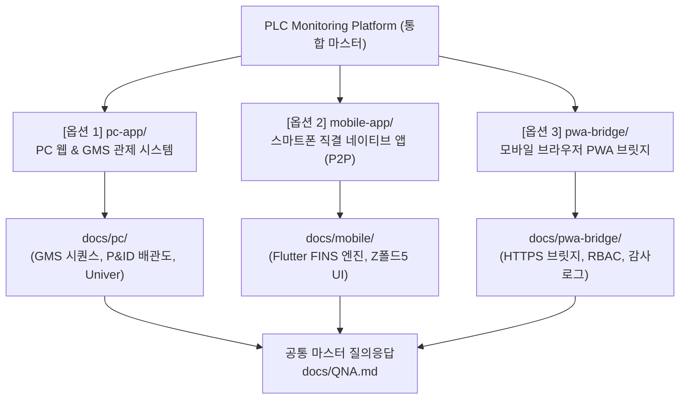
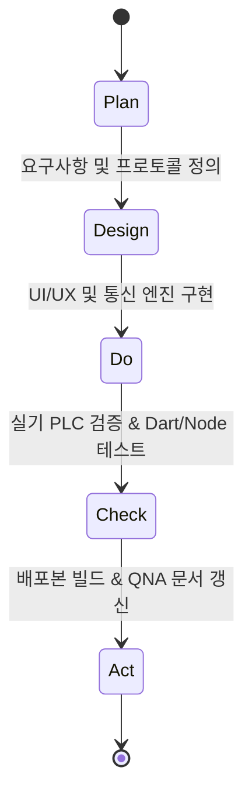

# [SKILL TREE] 3-in-1 PLC 모니터링 & 제어 시스템 개발 헌장

> 💡 **개발자 멘토링 헌장 (Senior Mentoring Guidelines)**
> 1. **한국어 원칙**: 모든 대화, 커밋 메시지, 주석, 문서화 및 AI 사고 과정(thinking)은 한국어로 작성합니다.
> 2. **20년 시니어 개발자 멘토링 톤앤매너**: 입문자/신입사원에게 알기 쉽게 하나씩 차근차근 설치부터 용어 설명, 아키텍처 원리까지 친절하고 깊이 있게 설명합니다.
> 3. **다이어그램 검증**: 모든 플로우차트 및 아키텍처는 반드시 Mermaid 문법으로 사전 검증 후 문서에 작성합니다.
> 4. **단일 질의응답 일원화**: 모든 개발 질문 및 피드백은 최상위 마스터 문서 [`docs/QNA.md`](../QNA.md)에 통합 누적 기록합니다.
> 5. **QNA 풀버전(Full-Text) 영구 기록 원칙**: QNA 기록 시 단순 요약에 그치지 않고, **채팅창에서 설명한 상세 가이드, Mermaid 아키텍처 다이어그램, 세부 기능 사양 및 조작법 전체를 100% 온전한 풀버전으로 누락 없이 영구 보존**합니다. (Good Response 클릭 여부와 무관하게 작업 즉시 실시간 자동 동기화)

---

## 🏗️ 3-in-1 아키텍처 분류 체계

---

## 📂 통합 문서 분류 맵 (Documentation Sitemap)

| 대분류 | 디렉터리 경로 | 주요 문서 및 역할 |
|:---|:---|:---|
| **마스터 공통** | `docs/` | • [`docs/PROJECT_MASTER_PDCA.md`](../PROJECT_MASTER_PDCA.md) : 전체 아키텍처 및 진척 매트릭스 • [`docs/QNA.md`](../QNA.md) : **전체 통합 질의응답 마스터 (Q-001 ~ Q-099, M-001~, P-001~)** • [`docs/00-start/SKILL_TREE.md`](SKILL_TREE.md) : 시스템 개발 헌장 및 기술 트리 |
| **PC 웹 & GMS** | `docs/pc/` | • `GMS_AUTO_SEQUENCE_HANDOFF.md` : GMS 7단계 가스공급 시퀀스 상세 • `GMS_SUBSEQUENCE_EXCEL_GUIDE.md` : 16개 서브시퀀스 엑셀 가이드 • `ISSUE_LOG_AND_DESIGN_STANDARDS.md` : PC FINS 프로토콜 및 UI 디자인 표준 • `01-plan/`, `02-design/`, `csv_subsequences/` |
| **모바일 직결 앱** | `docs/mobile/` | • `00-start/QA_LOG.md` : 모바일 전용 빌드 및 실기 테스트 로그 • `01-plan/PLAN.md`, `ENVIRONMENT.md` : 모바일 FINS UDP 프로토콜 규격 • `02-design/DESIGN.md` : 갤럭시 Z 폴드5 듀얼 반응형 UI 설계 • `04-check/TEST_REPORT.md`, `05-act/REPORT.md` : APK 빌드 및 릴리스 보고서 |
| **PWA 브릿지** | `docs/pwa-bridge/` | • `00-start/PROJECT_START.md` : PWA 브릿지 요구사항 및 배경 • `01-plan/schema.md`, `mobile-screen-plan.md` : SQLite 스키마 및 화면 계획 • `02-design/design.md` : HTTPS 세션 및 3단계 RBAC 보안 아키텍처 • `04-check/TEST_REPORT.md` : PWA 서비스워커 및 HTTPS 실기 검증 |

---

## 🚀 PDCA 단계별 개발 라이프사이클

1. **Plan (기획)**: 기능 정의, PLC 메모리 할당표(D/H/W/CIO/EM) 분석, 화면 기획서 작성.
2. **Design (설계)**: 통신 프레임 규격(FINS 0101, 0102, 0104, 0501, 0601) 정의, UI 테마 및 반응형 레이아웃 설계.
3. **Do (구현)**: `pc-app/`, `mobile-app/`, `pwa-bridge/` 소스코드 작성.
4. **Check (검증)**: 실기 PLC 통신 응답(지연시간 ms), 데이터 타입 인코딩 무결성 검증, 빌드 무결성 확인.
5. **Act (배포/문서화)**: 설치 파일(`exe`/`apk`) 생성 및 [`docs/QNA.md`](../QNA.md)에 일련번호로 작업 기록.
