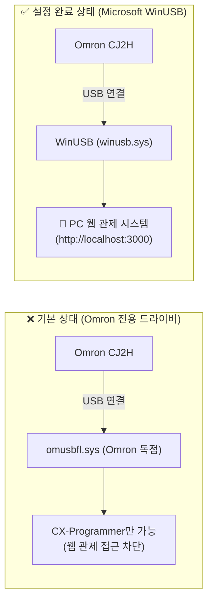

# 📘 OMRON CJ2H PC 관제 시스템 USB (WinUSB) 설정 완벽 매뉴얼

> **문서 목적**:  
> PC 웹 관제 시스템(`http://localhost:3000`)에서 OMRON CJ2H PLC와 USB 직결 통신을 수행하기 위해,  
> **최초 1회 Microsoft 표준 WinUSB 드라이버로 설정하는 전 과정**을 단계별 화면 캡처 형태로 상세히 안내합니다.

---

## 1. 개요 및 기술 배경 (왜 이 설정이 필요한가요?)



* **원리**: Windows OS는 기본적으로 Omron PLC를 인식하면 유료 전용 드라이버(`omusbfl.sys`)를 강제 바인딩합니다.
* **해결책**: 마이크로소프트의 공식 표준 범용 드라이버인 **`WinUSB (winusb.sys)`** 로 1회 교체해 주면, 웹 관제 서버(Node.js)가 PLC의 Bulk 통신 파이프를 열어 밸브와 센서 데이터를 실시간으로 읽고 쓸 수 있습니다.
* 💡 **참고**: 이 설정은 PC에서 **최초 1회만** 수행하시면 되며, PC를 재부팅하거나 케이블을 뺐다 꽂아도 계속 유지됩니다.

---

## 2. 사전 준비 사항

1. **하드웨어 연결**:
   - OMRON CJ2H PLC 전면의 **USB-B 포트**와 PC의 **USB-A (또는 USB-C) 포트**를 표준 USB 케이블로 연결합니다.
   - PLC 전원이 켜져 있는지 확인합니다 (`PWR` 램프 점등).
2. **설정 도구 (Zadig)**:
   - 오픈소스 공식 드라이버 관리 도구 **`Zadig`** 를 다운로드합니다.
   - 공식 웹사이트: [https://zadig.akeo.ie/](https://zadig.akeo.ie/) (무설치 단독 실행 파일 `zadig.exe`)

---

## 3. 단계별 설정 가이드 (Step-by-Step)

### [Step 1] Zadig 실행
* 다운로드한 `zadig.exe`를 마우스 우클릭하여 **[관리자 권한으로 실행]** 합니다.
* Windows 사용자 계정 컨트롤(UAC) 확인 창이 뜨면 **[예]** 를 클릭합니다.

---

### [Step 2] 숨겨진 모든 장치 목록 표시 (List All Devices)
* Zadig 초기 화면에서는 일부 장치가 숨겨져 있을 수 있습니다.
* 상단 메뉴 바에서 **`Options`** 를 클릭하고, **`List All Devices`** 항목을 **체크(선택)** 합니다.

```
┌────────────────────────────────────────────────────────┐
│  Zadig 2.8                                      - □ ✕  │
├────────────────────────────────────────────────────────┤
│  Device  [ Options ]  Help                             │
│          ┌──────────────────────────┐                  │
│          │ ✔ List All Devices       │ ◀── [반드시 체크!] │
│          │   Ignore Hubs or Comp... │                  │
│          │   Sign Catalog & Aut...  │                  │
│          │   Advanced Mode          │                  │
│          │   Log Verbosity          │                  │
│          └──────────────────────────┘                  │
└────────────────────────────────────────────────────────┘
```

---

### [Step 3] OMRON PLC 장치 선택
* 상단 드롭다운 목록을 클릭하여 **`OMRON SYSMAC PLC Device`** (또는 `OMRON CJ2H`)를 선택합니다.
* 🔍 **장치 ID 확인**:
  - 화면 하단의 **`USB ID`** 가 **`0590` `005B`** 로 표시되는지 확인합니다.
  - (Vendor ID: `0x0590` = OMRON Corporation / Product ID: `0x005B` = SYSMAC PLC)

```
┌────────────────────────────────────────────────────────┐
│  Zadig                                                 │
├────────────────────────────────────────────────────────┤
│                                                        │
│  [ OMRON SYSMAC PLC Device                   ▼ ] ◀───선택!
│                                                        │
│   Driver:  (NONE) 또는 omusbfl   ➔   [ WinUSB       ▲ ] │
│   USB ID:  0590   005B               (v6.1.7600.16385) │
│                                                        │
│            ┌─────────────────────────────┐             │
│            │   Replace Driver / Install  │ ◀── [클릭]  │
│            └─────────────────────────────┘             │
└────────────────────────────────────────────────────────┘
```

---

### [Step 4] 대상 드라이버를 'WinUSB'로 확인 후 설치
* 화살표 우측의 대상 드라이버 선택 상자가 **`WinUSB (v6.1.7600.16385)`** 로 되어 있는지 확인합니다.
* 가운데 큰 버튼 **`[Install Driver]`** (또는 이미 다른 드라이버가 있으면 **`[Replace Driver]`**)를 클릭합니다.
* 드라이버 설치가 진행되는 동안 약 10~30초 정도 소요됩니다.

---

### [Step 5] 설치 완료 확인
* 설치가 성공적으로 끝나면 아래와 같은 안내 메시지 팝업이 나타납니다:

```
┌──────────────────────────────────────────────┐
│  Zadig                                       │
├──────────────────────────────────────────────┤
│  ✔ The driver was installed successfully.    │
│                                              │
│                   [ Close ]                  │
└──────────────────────────────────────────────┘
```

* **[Close]** 를 누르고 Zadig 프로그램을 종료합니다. 이제 모든 준비가 완료되었습니다!

---

## 4. PC 관제 시스템 접속 및 통신 테스트

1. **PC 웹 관제 서버 기동**:
   - 명령 프롬프트나 백그라운드에서 `pc-app` 서버가 동작 중인지 확인합니다 (기본 포트: 3000).
2. **웹 브라우저 접속**:
   - 크롬(Chrome) 또는 엣지(Edge) 브라우저를 열고 `http://localhost:3000` (또는 `http://localhost:3000/gms.html`)로 접속합니다.
3. **통신 연결**:
   - 상단 연결 툴바에서 프로토콜을 **`USB`** 로 선택합니다.
   - **`[연결]`** 버튼을 누릅니다.
   - 상단 연결 인디케이터가 초록색으로 점등되며, **`CPU: CJ2H-CPU65-EIP (RUN)`**, **`지연시간: 1~3ms`** 가 표시되는지 확인합니다.

---

## 5. 자주 묻는 질문 및 문제 해결 (FAQ & Troubleshooting)

### Q1. 나중에 CX-Programmer로 래더를 수정해야 할 때는 어떻게 하나요?
* **해결 방법**:
  1. Windows **[장치 관리자]** 를 엽니다 (`Win + X` ➔ `장치 관리자`).
  2. **[범용 직렬 버스 장치]** 아래의 `OMRON SYSMAC PLC Device`를 마우스 우클릭 ➔ **[디바이스 제거]** 를 선택합니다.
  3. *(중요)* **"이 장치의 드라이버 소프트웨어를 삭제합니다" 체크박스는 해제**한 상태로 [제거]를 누릅니다.
  4. 상단 메뉴 [동작] ➔ [하드웨어 변경 사항 검색]을 누르면 Windows가 다시 원래의 Omron 기본 드라이버로 복구합니다.

### Q2. 드라이버 설정 없이 CX-Programmer와 웹 관제를 동시에 쓰는 방법은 없나요?
* **가장 추천하는 방법 (Ethernet 랜선 직결)**:
  - PC와 PLC를 일반 랜선(LAN 케이블)으로 연결하고 웹 관제에서 **`Ethernet (FINS UDP/TCP)`** 모드를 사용하시면, **Zadig 설정 없이도 CX-Programmer와 웹 관제 시스템을 100% 동시에 실행**할 수 있습니다.
