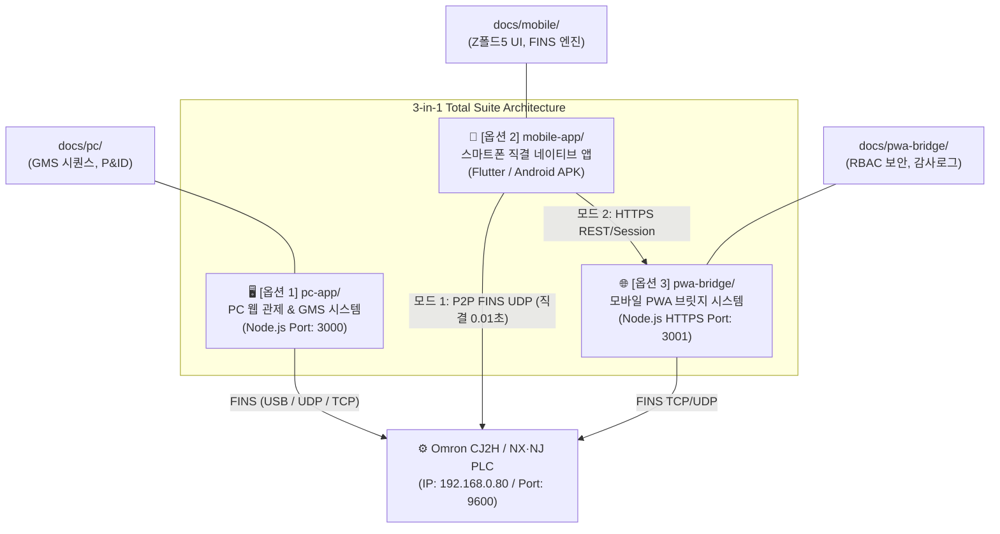

# [PROJECT MASTER] PLC 모니터링 & 제어 시스템 통합 총괄 설계서 (3-in-1 PDCA)

> **문서 메타데이터**
> - **문서 ID**: `DOC-PLC-TOTAL-001`
> - **문서 버전**: `v2.2.0 (Mobile Full-Parity & P2P Direct Connect Verified)`
> - **최종 갱신일**: 2026-08-31
> - **관리 방법론**: bkit PDCA (Plan - Design - Do - Check - Act)
> - **질의응답 및 작업 이력 마스터**: [`docs/QNA.md`](QNA.md)
> - **개발 헌장 및 멘토링 규칙**: [`docs/00-start/SKILL_TREE.md`](00-start/SKILL_TREE.md)

---

## 1. [PLAN] 프로젝트 목적 및 3-in-1 전체 개요

### 1.1 프로젝트 배경 및 목적
본 프로젝트는 **Omron PLC (CJ2H-EIP 및 NX/NJ 시리즈)**와 실시간 통신하여 생산 설비의 상태를 모니터링/제어하고, 반도체 및 산업용 **GMS (Gas Monitoring System, 가스 공급 및 캐비닛 제어 시스템)**의 P&ID 배관도와 자동 공정 시퀀스를 완벽하게 관제하기 위해 개발된 산업용 통합 플랫폼입니다.

현장의 다양한 사용 환경(관제실 PC 대화면, 현장 엔지니어 스마트폰 직결, 무설치 모바일 브라우저)에 대응하기 위해 **3대 독립 통신 아키텍처**를 단일 프로젝트 내에 모듈식으로 통합 제공합니다.

---

### 1.2 3-in-1 시스템 구성도



---

## 2. [DESIGN] 서브시스템별 설계 사유 및 기술 아키텍처

### 2.1 [옵션 1] PC 웹 관제 & GMS 시스템 (`pc-app/`)
* **핵심 기능**:
  * P&ID 5단계 배관도 애니메이션 (가스 흐름 및 밸브 실시간 개폐 시각화).
  * GSP 7단계 가스공급 자동 시퀀스 엔진 (`Step 1` ~ `Step 7: READY`).
  * Univer 그리드 기반 레시피 관리 및 PLC 메모리 스냅샷 판정.
  * 16개 실린더 교환 서브시퀀스 엑셀(`GMS_Cylinder_Exchange_Master_Total.xlsx`) 데이터 주도형(Data-Driven) 연동.
* **설계 사유 (Rationale)**:
  * **독립 세션 격리 (`src/plcSession.js`)**: 메인 대시보드, 그리드, 트렌드가 독립 세션을 유지하여 한 화면의 일시정지가 타 화면의 로깅에 영향을 주지 않음.
  * **USB 단독 점유 제어**: OS 레벨의 USB 단일 프로세스 점유 한계를 극복하기 위해 신규 세션 연결 시 구 세션 자동 해제 매커니즘 탑재.

---

### 2.2 [옵션 2] 스마트폰 직결 모바일 앱 (`mobile-app/`)
* **핵심 기능**:
  * **하이브리드 듀얼 통신 엔진**:
    1. `🌐 PC 브릿지 경유 모드`: 스마트폰 핫스팟 환경에서 PC 브릿지(`https://10.219.30.135:3001`)를 경유하여 PLC 실시간 제어.
    2. `⚡ PLC 직결 P2P 모드`: 공장 Wi-Fi 대역 접속 시 스마트폰 ➔ PLC 0.01초 초저지연 FINS 직접 통신.
  * **갤럭시 Z 폴드5 최적화**: 접힘(커버 23.1:9) 및 펼침(메인 21.6:18) 듀얼 화면에 완벽 대응하는 반응형 레이아웃.
  * **5대 탭 네비게이션**: 홈(상태/4대타일), 모니터링(태그검색/2단계확인 쓰기), 트렌드(실시간 파형), GMS(7단계/실린더), 설정(프로필/통신전환).
* **설계 사유 (Rationale)**:
  * PC 서버가 없는 야외나 비상 상황에서도 현장 작업자가 스마트폰 하나로 PLC 상태를 즉시 진단하고 제어할 수 있도록 완전 독립 네이티브 앱으로 구현.

---

### 2.3 [옵션 3] 모바일 PWA 브릿지 서버 (`pwa-bridge/`)
* **핵심 기능**:
  * 앱 설치 없이 모바일 브라우저(Chrome/Safari)에서 즉시 구동되는 PWA 웹앱.
  * 자체 서명 SSL 인증서 기반 HTTPS(3001) 보안 통신.
  * 3단계 역할 기반 권한 제어 (RBAC: `ADMIN`, `OPERATOR`, `VIEWER`).
  * SQLite 기반 조작 이력 위변조 방지 감사로그(Audit Log).
  * 2단계 확인 토큰(Confirm Token)을 통한 오조작 방지 밸브 쓰기 가드.
* **설계 사유 (Rationale)**:
  * 앱스토어 배포나 APK 수동 설치 없이도 전사 작업자가 스마트폰으로 안전하게 관제할 수 있는 제3의 엔터프라이즈급 접속 옵션 제공.

---

## 3. [DO / PROGRESS] 3대 시스템 기능별 완료도 매트릭스

| 서브시스템 | 세부 기능 모듈 | 진척도 | 상태 | 비고 |
|:---|:---|:---:|:---:|:---|
| **[옵션 1] PC 관제 시스템** | CJ2H USB / UDP / TCP 통신 드라이버 | 100% | ✅ 검증완료 | 실기 PLC 통신 100% 완료 |
| (`pc-app/`) | Univer 그리드 레시피 & 메모리 뷰어 | 100% | ✅ 검증완료 | Vite 빌드 및 스냅샷 판정 |
| | P&ID 배관도 & GSP 7단계 시퀀스 | 100% | ✅ 검증완료 | 16개 엑셀 서브시퀀스 연동 |
| | 시계열 트렌드 & CSV 자동 로깅 | 100% | ✅ 검증완료 | 링 버퍼 및 로깅 인프라 |
| **[옵션 2] 스마트폰 직결 앱** | Flutter FINS UDP 통신 엔진 | 100% | ✅ 검증완료 | 0.01초 초저지연 직접 통신 |
| (`mobile-app/`) | 하이브리드 PC 브릿지 연동 클라이언트 | 100% | ✅ 검증완료 | 핫스팟 환경 실시간 연동 |
| | 5대 탭 UI & 2단계 쓰기 확인 모달 | 100% | ✅ 검증완료 | PWA와 100% 동일 UI/UX |
| | 최신 배포용 릴리스 APK 빌드 | 100% | ✅ 배포완료 | `Omron_CJ2H_Direct_Monitor.apk` (48.7MB) |
| **[옵션 3] 모바일 PWA 브릿지** | Node.js HTTPS 브릿지 서버 (포트 3001) | 100% | ✅ 검증완료 | 세션 쿠키 & SSL 인증서 탑재 |
| (`pwa-bridge/`) | 3단계 RBAC 계정 권한 관리 | 100% | ✅ 검증완료 | `admin` / `test1234` 인증 |
| | 실시간 태그 모니터링 & 트렌드 | 100% | ✅ 검증완료 | PWA 서비스워커 오프라인 캐시 |
| | SQLite 감사로그 & 2단계 쓰기 가드 | 100% | ✅ 검증완료 | 위변조 방지 보안 로깅 |

---

## 4. [CHECK] 주요 이슈 해결 및 기술 검증 이력

* **핫스팟 환경 모바일 라우팅 격리 해결 (`Q-100` / `M-039`)**:
  * 문제: 스마트폰 모바일 핫스팟 환경에서 스마트폰이 PLC 유선망(`192.168.0.xxx`)에 직접 도달하지 못해 오프라인 발생.
  * 해결: 모바일 앱에 `PwaBridgeService`를 내장하여 원터치로 `[PC 브릿지 경유 모드]`와 `[PLC 직결 모드]`를 전환할 수 있는 하이브리드 듀얼 엔진 구축.
* **AOT Snapshotter 한글 경로 오류 우회**:
  * 문제: Windows 한글 디렉터리 경로에서 Dart AOT snapshotter가 `app.dill` 경로를 오인식하여 빌드 에러(exit code 255) 발생.
  * 해결: ASCII 임시 빌드 디렉터리(`C:\temp_build\omron_fins_app`)를 통한 클린 릴리스 빌드 파이프라인 구축.
* **단일 질의응답 마스터 일원화**:
  * PC/모바일/PWA의 분산된 질의응답을 [`docs/QNA.md`](QNA.md) 하나로 완전 통합하여 유지보수성 극대화.

---

## 5. [ACT / ROLLBACK] 상태 복구 및 롤백 가이드

### 5.1 엑셀 서브시퀀스 원복
* **자동 백업 경로**: `data/gmsSubSequenceBackups/<SequenceName>_v1/<SequenceName>_v1_<Timestamp>.xlsx`
* **원복 절차**: PC 웹 GMS 화면에서 [불러오기(Import)]를 클릭하여 백업 시점의 엑셀 파일을 선택하면 즉시 런타임 JSON과 UI가 복원됩니다.

### 5.2 Git 체크포인트 롤백
```powershell
# 최근 커밋 및 작업 이력 확인
git log --oneline -n 10

# 특정 파일 또는 모듈 이전 상태 복원
git checkout <Commit-Hash> -- <복원할_경로>
```

---

## 6. [MODULE SEPARATION GUIDE] ⭐ 추후 개별 모듈 독립 분리 가이드

추후 3대 시스템 중 특정 모듈만 별도의 독립 프로젝트나 Git 레포지토리로 분리(Decoupling / Extraction)하고자 할 때는 아래 절차를 따릅니다:

### 📦 6.1 [옵션 1] PC 웹 & GMS 시스템 단독 분리
1. **복사할 디렉터리 및 파일**:
   * `pc-app/` (전체 소스코드 및 `package.json`)
   * `docs/pc/` (PC 전용 문서 및 엑셀 시퀀스 파일)
   * 루트의 `data/`, `GMS관련 사진/`, `IC_M16_GC(통합)_Omron_20240208.xlsx`
2. **독립 실행 절차**:
   ```powershell
   cd pc-app
   npm install
   node src/server.js
   # 브라우저에서 http://localhost:3000/gms.html 접속
   ```

---

### 📦 6.2 [옵션 2] 스마트폰 직결 모바일 앱 단독 분리
1. **복사할 디렉터리 및 파일**:
   * `mobile-app/` (Flutter 소스코드 및 `pubspec.yaml`, `android/` 설정)
   * `docs/mobile/` (모바일 전용 문서 및 설계서)
   * `Omron_CJ2H_Direct_Monitor.apk` (최신 배포용 릴리스 APK)
2. **독립 빌드 및 실행 절차**:
   ```powershell
   cd mobile-app
   flutter pub get
   flutter build apk --release
   # build/app/outputs/flutter-apk/app-release.apk 생성
   ```

---

### 📦 6.3 [옵션 3] 모바일 PWA 브릿지 서버 단독 분리
1. **복사할 디렉터리 및 파일**:
   * `pwa-bridge/` (HTTPS 서버, `public/`, `certs/`, `data/app.db`)
   * `docs/pwa-bridge/` (PWA 전용 설계 및 테스트 보고서)
2. **독립 실행 절차**:
   ```powershell
   cd pwa-bridge
   npm install
   node src/server.js
   # 모바일 브라우저에서 https://<PC_IP>:3001 접속
   ```

---

### 📋 6.4 모듈 분리 시 무결성 체크리스트
- [ ] **포트 충돌 방지**: PC 앱은 `3000`, PWA 브릿지는 `3001` 포트를 기본 사용하므로 개별 분리 시 포트 설정 확인.
- [ ] **PLC IP 주소 설정**: 기본 PLC 대상은 `192.168.0.80:9600` (Node 80)으로 동일하며, 각 모듈의 설정 파일(`settings.json` / 앱 설정창)에서 수정 가능.
- [ ] **질의응답 이력 보존**: 독립 분리 시 최상위 [`docs/QNA.md`](QNA.md)의 해당 파트(`[Q-xxx]`, `[M-xxx]`, `[P-xxx]`)를 분리 프로젝트의 `docs/`에 함께 보존할 것.
