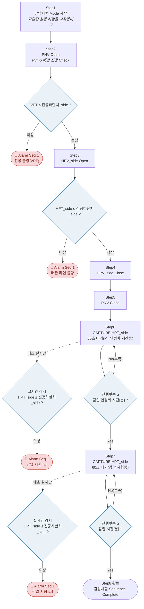

# 교환전 -L (감압시험) — ExchL_v1 플로우차트

`data/gmsSubSequences/ExchL_v1.json` 기준, 실제 Step/조건/알람 그대로 반영.
VS Code 등 Mermaid를 지원하는 마크다운 미리보기에서 도표로 렌더링된다.

## 구간 요약

| 구간 | Step | 내용 |
|---|---|---|
| 진공 확인 | 1~2 | PNV Open, Pump 배관 진공(VPT) 확인 |
| 배관 라인 확인 | 3~5 | HPV_side Open→Close, PNV Close |
| 감압 안정화 | 6~6A | 60초씩 반복 + 실시간 안전감시, "감압 안정화 시간[분]"(CONFIG) 채울 때까지 |
| 감압 시험 | 7~7A | 60초씩 반복 + 실시간 안전감시, "감압 시간[분]"(CONFIG) 채울 때까지 |
| 완료 | 8 | 감압시험 Sequence Complete |

같은 60초 대기+실시간 감시+분단위 판정 패턴이 Pumping(OneP3)과 동일하게 재사용되고 있고,
6/6A와 7/7A 두 구간 모두 각자 독립적으로 "진행횟수"를 0부터 다시 센다(엔진이 Step 번호가
바뀔 때 자동 리셋 - `gms-sub-sequence-runner.js`의 `cycleCheckStepIndex` 처리).
