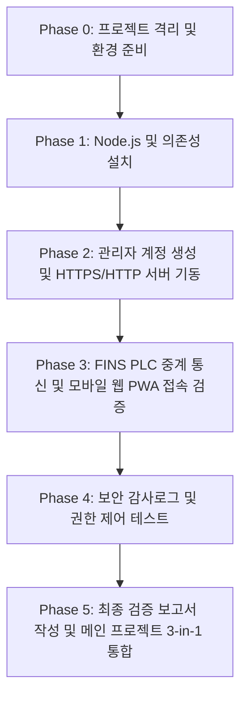

# 프로젝트 마스터 계획서 (PLAN) — 03. mobile-pwa-bridge

## 1. 프로젝트 개요
- **목적**: PC에 Node.js 브릿지 서버를 실행하고, 스마트폰/태블릿에서는 별도 앱 설치 없이 브라우저(PWA)를 통해 안전하게 PLC(Omron CJ2H)를 모니터링 및 제어하는 시스템 검증.
- **핵심 기술**: Node.js v24 (내장 `node:sqlite`), Express, WebSocket, FINS/TCP·UDP 중계, PWA (Service Worker + Manifest), Role-based Access Control (ADMIN/OPERATOR/VIEWER), 감사 로그 (AuditLog).

---

## 2. 작업 단계 (WBS)

---

## 3. 네트워크 및 포트 할당
- **PLC**: `192.168.0.80:9600` (Omron CJ2H FINS)
- **PC 브릿지 서버**: `192.168.0.211:3001` (HTTP/HTTPS)
- **모바일 접속 주소**: `http://192.168.0.211:3001` (또는 `https://192.168.0.211:3001`)
